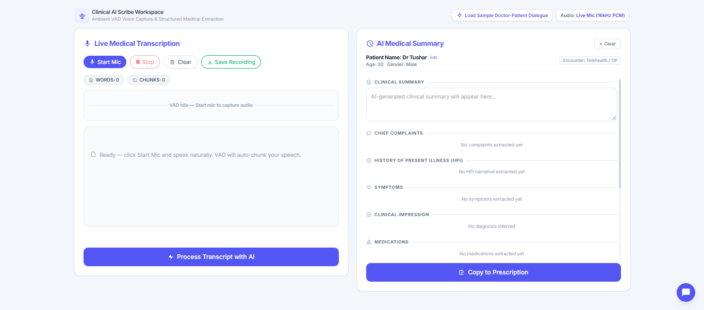
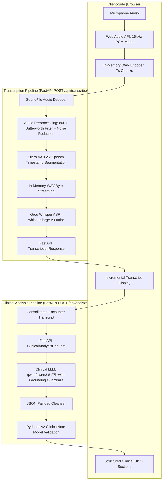

# Medical Transcriber & Clinical Summarizer

An end-to-end, real-time medical transcription and clinical information extraction system engineered for ambient doctor-patient consultations. The application captures audio directly from the browser microphone in deterministic 7-second chunks, cleans the signal through high-pass filtering and stationary noise reduction, segments speech with Silero VAD, transcribes audio using Whisper, and incrementally streams the dialogue to a live transcript view. Upon consultation completion, the consolidated transcript is processed by a clinical LLM governed by zero-hallucination guardrails, producing a validated, strongly-typed Pydantic medical record rendered across 11 structured clinical UI sections.

The architecture enforces a strict decoupling between **Audio Processing → ASR → Transcript State → Clinical Analysis → Schema Validation → UI Presentation**.



---

# Key Engineering Highlights

- **Layered Architecture**: Clear separation of concerns across presentation (`frontend/`), API transport (`backend/api/`), domain services (`backend/services/`), and typed data schemas (`backend/schemas/`).
- **In-Memory Audio Processing**: Audio buffers are resampled, filtered, and segmented entirely in-memory using PyTorch and SoundFile, eliminating temporary file I/O overhead and disk-wear bottlenecks.
- **Deterministic Browser-Side Chunking**: Uses the Web Audio API to capture 16 kHz mono PCM frames in 7-second sliding buffers (`chunkDurationMs`), providing predictable streaming cadence without blocking the browser thread.
- **Two-Stage Audio Preprocessing**: Implements an 80 Hz 6th-order Butterworth high-pass filter to remove mechanical and HVAC rumble alongside calibrated stationary noise reduction before speech detection.
- **Deep-Learning Voice Activity Detection (VAD)**: Employs Silero VAD v5 to isolate human speech segments and filter out silence, preventing empty audio chunks from consuming downstream ASR compute.
- **Incremental Transcription Streaming**: Transcribes incoming chunks iteratively so dialogue appears progressively during the consultation rather than delaying all feedback until recording concludes.
- **Context-Preserving Clinical Analysis**: Triggers a single LLM analysis request only when the consultation ends, providing global context across the entire encounter while eliminating redundant LLM requests.
- **Strongly-Typed Schema Validation**: Enforces runtime validation using Pydantic v2 (`ClinicalNote`), creating a reliable contract between non-deterministic LLM JSON outputs and frontend rendering components.
- **Clinical Pertinent Negatives Separation**: Schema and prompt guardrails explicitly segregate confirmed symptoms (`symptoms.positive`) from denied conditions (`symptoms.negative`), preventing clinical ambiguity.
- **Rigorous Multi-Level Test Suite**: Comprehensive testing spanning audio DSP filtering, VAD segmentation, in-memory ASR streaming, FastAPI endpoints (`TestClient`), and zero-hallucination guardrail validation.

---

# Architecture

The system coordinates two independent pipelines: an **Incremental Transcription Pipeline** for real-time speech capture and an **Asynchronous Clinical Analysis Pipeline** for structured information extraction.



---

# Engineering Decisions

### Why Chunked Audio Processing?
Transcribing audio in short browser-side chunks (7 seconds) enables progressive transcript streaming. Clinicians receive immediate visual feedback during consultations instead of waiting for a single large audio file to upload and process at the conclusion of an encounter. The cadence is deliberately 7 seconds rather than shorter: every chunk triggers a full decode → preprocess → VAD → ASR round-trip and uploads are serialised through a single client-side promise chain, so a tighter interval would double the request rate and let the queue outpace the provider round-trip on slower connections.

### Why VAD Before ASR?
Ambient medical environments contain natural pauses, deep breaths, and clinician thinking time. Running Silero VAD before calling Whisper drops non-speech silence, drastically reducing API payload sizes, avoiding transcription hallucinations on low-energy background audio, and reducing latency.

### Why Preprocess Before VAD and ASR?
Sub-vocal room hum, air conditioning vibrations, and microphone contact noise typically live below 80 Hz. Applying an 80 Hz high-pass Butterworth filter strips this low-frequency energy before it reaches the VAD model. Moderate spectral noise reduction (`prop_decrease` driven by `NOISE_REDUCTION_STRENGTH`, default `0.5`) further cleans ambient room noise while strictly preserving high-frequency speech consonants (*s, t, p, k*) that differentiate critical medical terms.

### Why Separate ASR from Clinical Analysis?
Speech-to-text and clinical entity extraction solve fundamentally distinct engineering problems. Keeping them in separate services adheres to the Single Responsibility Principle, allowing independent testing, isolated scaling, and model swapping (e.g., swapping Whisper models or switching LLM providers) without coupling speech mechanics to extraction logic.

### Why Pydantic Schemas?
Large Language Models output non-deterministic text. Pydantic v2 schemas act as an enforced runtime boundary, guaranteeing that fields, nested arrays, and data types (such as age constraints and string arrays) strictly conform to expected models before reaching the frontend.

### Why Analyze Only After Recording Completion?
Consultation context develops non-linearly: a symptom mentioned at the beginning may be revised, ruled out, or diagnosed minutes later. Running clinical extraction once against the consolidated transcript guarantees that the LLM has complete global context while eliminating unnecessary API costs on partial utterances.

### Why Modular Services?
Isolating DSP (`audio_processing.py`), speech detection (`vad.py`), transcription streaming (`asr.py`), and LLM extraction (`llm.py`) inside `backend/services/` decouples algorithmic logic from FastAPI HTTP routing (`backend/api/`), ensuring high cohesion, testability, and code maintainability.

---

# End-to-End Data Flow

```text
1. User starts recording in the web client.
2. Web Audio API captures microphone input via a ScriptProcessorNode at 16 kHz.
3. Audio frames are buffered and converted into 16-bit PCM WAV blobs in client memory.
4. Chunks are dispatched every 7 seconds to POST /api/transcribe/, carrying the transcript of previous chunks as `context`.
5. Backend decodes bytes using SoundFile and downmixes multi-channel audio to mono.
6. Audio preprocessing executes high-pass filtering (80 Hz) and stationary noise reduction.
7. Silero VAD detects speech timestamps, discarding silence and segments shorter than VAD_MIN_SEGMENT_SECONDS (0.18 s by default).
8. Active speech segments are converted in-memory to WAV byte buffers.
9. Groq Whisper (whisper-large-v3-turbo) transcribes each segment, using the accumulated transcript as a context prompt capped at ASR_PROMPT_MAX_CHARS characters.
10. Backend returns structured JSON containing segment timestamps and transcript text.
11. Frontend incrementally appends new segments and refreshes word and chunk statistics.
12. User clicks Stop Mic; client awaits in-flight uploads and flushes trailing audio buffers.
13. Consolidated transcript is submitted in a single request to POST /api/analyze/.
14. Groq LLM (qwen/qwen3.8-27b) parses dialogue using zero-hallucination clinical prompts.
15. Extracted JSON is validated against the Pydantic ClinicalNote schema.
16. Validated model data is rendered into the 11 clinical review sections in the UI.
```

---

# Clinical Information Model

The clinical extraction pipeline structures the transcript into a typed `ClinicalNote` model comprising 11 medical record sections:

- **Patient Demographics (`patient_details`)**: Name, age (validated 0–150), sex, and explicit record identifiers.
- **Chief Complaint (`chief_complaint`)**: Primary reason for consultation articulated in patient terms.
- **History of Present Illness (`history_of_present_illness`)**: Chronological narrative of symptom onset, duration, and progression.
- **Symptoms (`symptoms`)**: Explicitly divided into:
  - `positive`: Symptoms confirmed present by the patient.
  - `negative`: Pertinent negatives explicitly denied (e.g., "denies fever, chest pain").
- **Medications (`medication_history`)**: Structured list with `name`, `dosage`, and `adherence`.
- **Allergies (`allergies`)**: Explicitly stated drug or environmental allergies.
- **Past Medical History (`past_medical_history`)**: Pre-existing medical conditions, hospitalizations, or surgeries.
- **Clinical Observations (`clinical_observations`)**: Vital measurements (temperature, blood pressure) and physical exam observations.
- **Assessment (`assessment`)**: Clinical impressions, diagnoses, or differentials stated by the healthcare provider.
- **Plan (`plan`)**: Prescribed therapies, laboratory investigations, lifestyle advice, and follow-up timing.
- **Clinical Summary (`clinical_summary`)**: Concise synthesized clinical overview for the patient medical record.

> **Engineering Control — Pertinent Negatives**: Confirmed symptoms and explicitly denied symptoms are maintained in separate arrays (`symptoms.positive` vs. `symptoms.negative`) to prevent clinical misinterpretation during review.

---

# API Specification

### `GET /health`
- **Purpose**: Service health and liveness check.
- **Response**: `{"status": "ok"}`

### `POST /api/transcribe/`
- **Purpose**: Ingests audio chunks, runs preprocessing and VAD, and returns timestamped speech transcriptions.
- **Request**: `multipart/form-data` (`file`: audio binary [WAV/MP3/OGG/FLAC], `language`: optional ISO code or `auto` — default `auto`, `context`: optional rolling transcript of earlier chunks, trimmed server-side to `ASR_PROMPT_MAX_CHARS` before it reaches the provider)
- **Response**: `application/json` (`TranscriptionResponse`)
- **Validation**: `400` invalid audio, `413` oversized upload, `422` invalid language, `503` provider unavailable.
  ```json
  {
    "text": "Doctor hello Rahul good to see you what brings you in today",
    "filename": "chunk.wav",
    "language": "en",
    "duration": 7.0,
    "segments": [{ "id": 0, "start": 0.32, "end": 3.18, "text": "Doctor hello Rahul good to see you what brings you in today" }]
  }
  ```

### `POST /api/analyze/`
- **Purpose**: Analyzes consultation text and extracts validated clinical entities.
- **Request**: `application/json` (`ClinicalAnalysisRequest`: `{"transcript": "Doctor: Hello Rahul... Patient: I have had fever..."}`)
- **Response**: `application/json` (`ClinicalAnalysisResponse` adhering to the `ClinicalNote` schema)
- **Validation**: `422` blank or oversized transcript, `503` provider unavailable.

### `GET /`
- **Purpose**: Serves the single-page application frontend from `frontend/index.html`.

---

# Project Structure

```text
medical-transcriber/
├── backend/
│   ├── api/
│   │   ├── transcription.py       # Audio ingestion, DSP, Silero VAD, and Whisper ASR endpoint
│   │   └── analysis.py            # Consultation transcript clinical analysis endpoint
│   ├── schemas/
│   │   ├── clinical.py            # Pydantic schemas: PatientDetails, Symptoms, Medication, ClinicalNote
│   │   └── transcription.py       # Pydantic schemas: WordTimestamp, Segment, TranscriptionResponse
│   ├── services/
│   │   ├── asr.py                 # In-memory WAV byte streaming to Groq Whisper
│   │   ├── audio_processing.py    # Butterworth high-pass filtering and stationary noise reduction
│   │   ├── llm.py                 # Grounded clinical LLM prompting with extraction guardrails
│   │   └── vad.py                 # Silero VAD speech chunk and segment extraction
│   ├── config.py                  # Pydantic BaseSettings environment variable loader
│   └── main.py                    # FastAPI app initialization, CORS middleware, and static mount
├── frontend/
│   ├── css/style.css              # Custom UI styling, custom scrollbars, and pulse animations
│   ├── js/
│   │   ├── app.js                 # UI orchestration, state management, and summary population
│   │   └── audio.js               # Web Audio API recording, 16kHz PCM WAV encoding, and canvas visualizer
│   └── index.html                 # Responsive two-column interface with 11 clinical review sections
├── tests/
│   ├── conftest.py                # Shared pytest fixtures and test lifecycle configuration
│   ├── helpers.py                 # In-memory deterministic synthetic audio generators
│   ├── test_api_analyze.py        # Integration test for POST /api/analyze/ with medical dialogue
│   ├── test_api_transcribe.py     # Integration test for POST /api/transcribe/
│   ├── test_asr.py                # Whisper transcription unit tests and mock integration
│   ├── test_clinical.py           # Pydantic schema validation and clinical analysis service test
│   ├── test_extraction_guardrails.py # Zero-hallucination validation on underspecified transcripts
│   ├── test_pipeline.py           # Full audio decode -> filter -> VAD -> Whisper integration pipeline
│   └── test_vad.py                # Preprocessing signal verification (RMS and peak amplitude change)
├── Img/
│   └── image.png                  # Application UI reference capture
├── .env.example                   # Environment configuration template
├── requirements.txt               # Project dependencies
└── README.md                      # Engineering documentation
```

---

# Testing & Validation

The test suite covers signal processing, voice detection, speech recognition, API endpoints, and extraction guardrails:

- **Audio & Signal Processing**: `tests/test_vad.py` validates the 80 Hz Butterworth high-pass filter by measuring RMS and peak signal delta; `tests/test_pipeline.py` executes audio decoding, 16 kHz resampling, DSP filtering, Silero VAD segmentation, and segment transcription end-to-end.
- **Speech-to-Text (ASR)**: `tests/test_asr.py` validates in-memory audio byte streaming and provider request construction with a mocked Groq client.
- **API Integration**: `tests/test_api_transcribe.py` tests `POST /api/transcribe/` multipart payload handling, file decoding, segment extraction, and JSON response formatting; `tests/test_api_analyze.py` tests `POST /api/analyze/` with doctor-patient dialogue, verifying extraction of demographics, symptoms, and diagnoses.
- **Clinical Extraction & Guardrails**: `tests/test_extraction_guardrails.py` executes guardrail testing on deliberately underspecified transcripts (omitting demographics, medications, vitals, and diagnoses), asserting that the clinical LLM leaves unmentioned fields `null` or empty without hallucinating unstated data; `tests/test_clinical.py` validates schema deserialization.

### Running the Test Suite
```powershell
# Run the complete test suite (provider calls are mocked)
pytest tests/

# Run individual component and pipeline tests
python tests/test_vad.py
python tests/test_asr.py
python tests/test_pipeline.py
python tests/test_api_transcribe.py
python tests/test_api_analyze.py
python tests/test_extraction_guardrails.py
```

---

# Setup & Running

Instructions for Windows using PowerShell:

### 1. Create and Activate Virtual Environment
```powershell
python -m venv .venv
.\.venv\Scripts\Activate.ps1
```

### 2. Install Project Dependencies
```powershell
pip install -r requirements.txt
```

### 3. Configure Environment Variables
Create your `.env` file from the example template:
```powershell
Copy-Item .env.example .env
```
Update `.env` with your Groq API credentials:
```ini
GROQ_API_KEY=your_groq_api_key_here
APP_HOST=127.0.0.1
APP_PORT=8000
CORS_ORIGINS=http://localhost:8000,http://127.0.0.1:8000
MAX_AUDIO_BYTES=26214400
MAX_AUDIO_DURATION_SECONDS=600
MAX_TRANSCRIPT_CHARS=100000
```

### 4. Start the Application Server
Run Uvicorn from the workspace root:
```powershell
uvicorn backend.main:app --reload --host 127.0.0.1 --port 8000
```

### 5. Access the Web Application
Open your browser and navigate to:
```text
http://localhost:8000/
```

---

# Configuration

| Variable | Required | Default | Description |
| :--- | :---: | :---: | :--- |
| `GROQ_API_KEY` | Yes for AI features | — | Authentication key for Groq Whisper ASR and Qwen clinical models |
| `APP_HOST` | No | `127.0.0.1` | Binding host address for FastAPI |
| `APP_PORT` | No | `8000` | Binding port for FastAPI |
| `CORS_ORIGINS` | No | Localhost origins | Comma-separated browser origins allowed to call the API |
| `ASR_MODEL` | No | `whisper-large-v3-turbo` | Groq speech-to-text model |
| `LLM_MODEL` | No | `qwen/qwen3.8-27b` | Groq clinical extraction model |
| `PROVIDER_TIMEOUT_SECONDS` | No | `30` | Maximum time allowed for each provider request |
| `ASR_CONTEXT_CHARS` | No | `1200` | Characters of rolling transcript context the API accepts per request |
| `ASR_PROMPT_MAX_CHARS` | No | `800` | Hard cap on the context sent as the Whisper `prompt` (provider allows ~224 tokens; see note below) |
| `VAD_THRESHOLD` | No | `0.35` | Silero speech probability threshold |
| `VAD_MIN_SPEECH_DURATION_MS` | No | `150` | Minimum speech region length Silero will report |
| `VAD_MIN_SILENCE_DURATION_MS` | No | `250` | Minimum silence required to close a speech region |
| `VAD_SPEECH_PAD_MS` | No | `180` | Padding added around detected speech |
| `VAD_MIN_SEGMENT_SECONDS` | No | `0.18` | Segments shorter than this are dropped before ASR |
| `NOISE_REDUCTION_STRENGTH` | No | `0.5` | Noise-reduction aggressiveness (0–1), applied as `prop_decrease = 1.0 - strength` |
| `MAX_AUDIO_BYTES` | No | `26214400` | Maximum uploaded audio payload size in bytes |
| `MAX_INPUT_SAMPLE_RATE` | No | `192000` | Highest input sample rate accepted before resampling |
| `MAX_AUDIO_DURATION_SECONDS` | No | `600` | Maximum duration accepted by the transcription endpoint |
| `MAX_LANGUAGE_CHARS` | No | `16` | Maximum accepted length of the `language` form field |
| `MAX_TRANSCRIPT_CHARS` | No | `100000` | Maximum transcript length sent to clinical analysis |

> **Why `ASR_PROMPT_MAX_CHARS` exists**: Groq Whisper accepts at most 224 tokens in the `prompt` field, and tokens are roughly 4–5 characters for clinical English. Sending more fails the entire request with a 400, which would silently drop a chunk of the consultation, so the effective prompt budget is `min(ASR_CONTEXT_CHARS, ASR_PROMPT_MAX_CHARS)` and the trim snaps to a word boundary.

---

# Operational Safeguards

- The UI requires explicit consent before sending microphone audio or a transcript to the configured AI provider.
- Uploads and transcripts are bounded, decoded defensively, and provider failures return `503` instead of silently becoming empty clinical data.
- The rolling transcript sent to the ASR provider as a `prompt` is clamped to a documented token-safe budget (`ASR_PROMPT_MAX_CHARS`) at a word boundary, so long consultations cannot overflow the provider's context window and fail mid-recording.
- The default server bind is loopback-only and CORS uses an explicit localhost allowlist. Put authentication, TLS, rate limiting, and a reverse proxy in front of any shared deployment.
- Clinical fields are rendered as data only; unknown patient details remain `Not specified`/`N/A` and are never filled with demo values.
- API responses include no-store and basic security response headers; avoid logging transcripts or raw provider errors in production.

---

# Assignment Requirement Coverage

| Assignment Requirement | Implementation |
| :--- | :--- |
| **Microphone Audio Capture** | Web Audio API capturing 16 kHz PCM audio with canvas waveform visualization ([frontend/js/audio.js](frontend/js/audio.js)) |
| **Voice Activity Detection (VAD)** | Silero VAD v5 deep-learning speech segmentation and timestamped chunking ([backend/services/vad.py](backend/services/vad.py)) |
| **Speech-to-Text (ASR) / Whisper** | Groq-hosted `whisper-large-v3-turbo` with in-memory WAV byte streaming ([backend/services/asr.py](backend/services/asr.py)) |
| **Live Transcript Display** | Periodic 7s chunk uploads, word/chunk counters, and interim ghost text ([frontend/js/app.js](frontend/js/app.js)) |
| **Full Transcript to LLM on Completion** | Automated single LLM request triggered upon recording stop via `onRecordingComplete` ([frontend/js/app.js](frontend/js/app.js)) |
| **Structured Medical Information Extraction** | Strongly-typed Pydantic `ClinicalNote` schema with strict zero-hallucination guardrails ([backend/schemas/clinical.py](backend/schemas/clinical.py), [backend/services/llm.py](backend/services/llm.py)) |
| **Clinical Summary** | Synthesized medical record narrative generated alongside structured entities ([backend/schemas/clinical.py](backend/schemas/clinical.py)) |
| **Python Backend** | FastAPI application with CORS, static file serving, and modular routers ([backend/main.py](backend/main.py)) |
| **JavaScript Frontend** | Vanilla ES Modules managing audio streaming, canvas drawing, and API communication ([frontend/js/app.js](frontend/js/app.js), [frontend/js/audio.js](frontend/js/audio.js)) |
| **HTML5 & CSS3** | Semantic layout with responsive Tailwind CSS utilities and custom styling ([frontend/index.html](frontend/index.html), [frontend/css/style.css](frontend/css/style.css)) |
| **Responsive UI** | Two-column grid adapting from desktop multi-column to single-column mobile viewports ([frontend/index.html](frontend/index.html)) |
| **API Integration** | Standardized REST endpoints connecting frontend clients to transcription and analysis pipelines ([backend/api/transcription.py](backend/api/transcription.py), [backend/api/analysis.py](backend/api/analysis.py)) |
| **State Management** | Centralized lifecycle tracking managing audio buffers, chunk indices, recording states, and clinical note population ([frontend/js/app.js](frontend/js/app.js)) |

---

# Technical Notes

- **Environment-Driven Configuration**: External speech and LLM API keys are managed through `.env` and loaded via Pydantic `BaseSettings`, preventing credential exposure.
- **Audio Context Permissions**: Browser security models require explicit user microphone permissions, and modern browsers restrict microphone APIs to `localhost` or HTTPS origins.
- **Acoustic Input Profile**: The system currently downmixes multi-channel audio to a single 16 kHz channel for acoustic consistency across different microphone hardware.
- **Pluggable Architecture**: Clear service interfaces enable drop-in replacements for ASR (e.g., local Whisper or cloud providers), VAD models, or LLM extraction engines with minimal changes.

---

# Future Engineering Extensions

- **WebSocket Audio Transport**: Implementing bidirectional WebSocket streaming to allow sub-second, continuous audio delivery alongside HTTP REST endpoints.
- **Speaker Diarization**: Integrating speaker clustering to automatically partition and tag doctor and patient speech turns.
- **FHIR & HL7 Standard Export**: Serializing extracted `ClinicalNote` records into standardized healthcare exchange formats (FHIR JSON resources).
- **Containerization & CI/CD**: Packaging the application into a multi-stage Docker container with automated test runs on pull requests.

---

# Conclusion

The Medical Transcriber & Clinical Summarizer showcases a production-oriented architecture combining real-time in-browser audio capture, digital signal preprocessing, deep-learning voice activity detection, Whisper ASR, and structured clinical extraction. By enforcing strong separation between speech recognition and clinical analysis, using in-memory audio buffers, and validating LLM outputs against strict Pydantic models, the project demonstrates a robust, maintainable, and engineering-first approach to automated clinical documentation.
